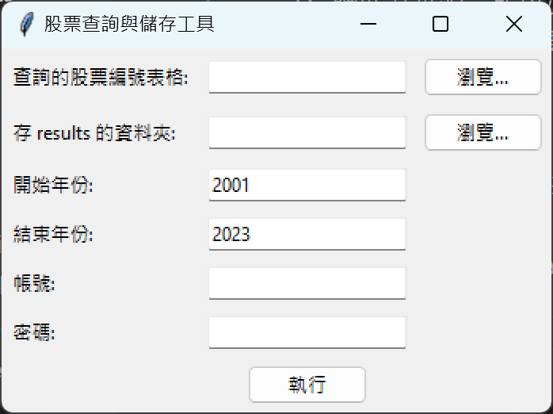
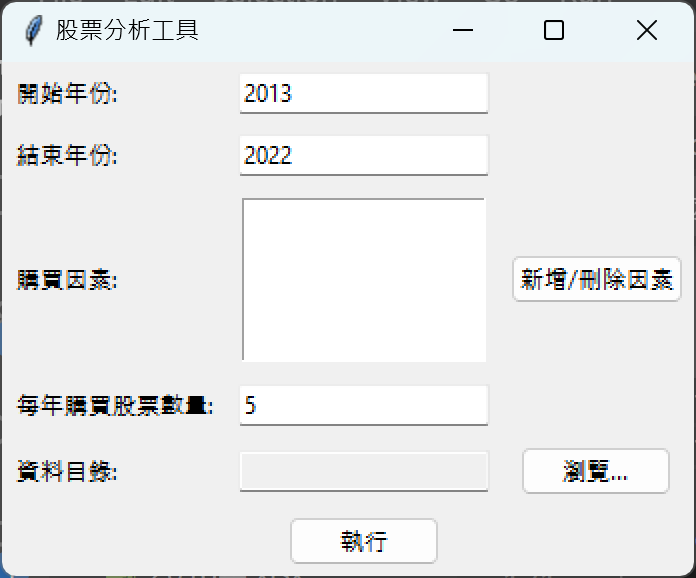
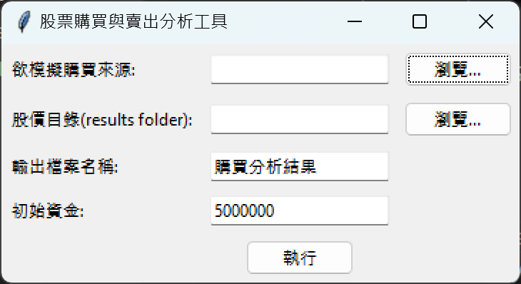

# Passion Project 最終成品: 股票分析工具

這是個幫助分析股票的工具，在說明功能之前，必須要先聲明一點重要資訊: **以下的工具雖然可以幫助你在投資上有更清楚的方向和方法，但這世界並不存在任何穩賺不賠的方法，且在過去找到的最佳方法並不會在未來也是最佳**

## 功能:
1. 蒐集從 2000 年開始的財報 (配合[財報狗](https://statementdog.com/)上的資料)、股價 (來自模組[twstock](https://twstock.readthedocs.io/zh-tw/latest/))
2. 用可調整權重的指標做各年的排序
3. 透過模擬買賣來分析漲跌與損益

## 在開始之前
1. 請先確認電腦是否安裝 Python 3 (建議安裝 Python 3.10 以上版本) 可點[此連結](https://www.python.org/downloads/)下載最新版 Python
2. 需要安裝 Firefox 瀏覽器
   1. 首先，必須要安裝好 Firefox，[此為下載連結](https://www.mozilla.org/en-US/firefox/new/)
   2. 接著，需要安裝爬蟲驅動，即是目前已經安裝好在資料夾內的 "getckodriver.exe"，只是若有版本問題，可以在[此連結](https://github.com/mozilla/geckodriver/releases)找到對應的其他版本
3. 可以先執行 "0. setup.py" 確認環境是否完全安裝成功
## 工具的細項說明

### 工具 1: 資料抓取

此工具可以用來爬取目標分析公司的過往財報及股價等，會抓取的細項內容包括以下數項，以年為單位 (除了股價)
* 股價 (六月第一個開盤日的收盤價)
* 營收
* 營業利益
* 稅後淨利
* 營業現金流
* 投資現金流
* ROE
* ROA
* 總負債
* 流動負債
* 固定資產
* 總資產
* 流動資產
* EPS
* 股數
* 淨資產
* 每股淨值
* 淨流動資產
* 長期負債
* 營業利率
* 自由資本比率
* 負債除以本期損益
* 本益比
* 股價淨值比

在財報部分，以 [財報狗](https://statementdog.com/) 網站為來源，所以必須要有財報狗的帳號，若要抓取大量資料，可能會需要有會員，否則會得到大量 Error

操作過程如下
1. 先將目標放入 Excel 表格中 (格式可以參考 "stocks.xlsx")
2. 開啟 "1. crawler.py" (過程約需 5 ~ 10 秒，第一次開可能會更久)
3. 會看到以下的視窗
   * 「查詢的股票編號表格」選擇剛剛建立的 Excel 表格
   * 「帳號」及「密碼」是財報狗的登入方式，若是使用 google 登入的需要額外建立帳號密碼
   * 資訊設定完成後按下「執行」即可，即可等待查詢完成後結果在所選的資料夾呈現

### 工具 2: 分析與整理

此工具可以用來挑選與排序以特定指標來找出最符合的前幾個股票，並且可使用權重挑選

規則如下:
挑選的每一個因素由高到低會分別給 股票數量, 股票數量 - 1, 股票數量 - 2 $\cdots$ 的分數 * 該項目的權重，將所有項目的分數加總後由大到小排序，在挑選指定數量的出來儲存在表格中

介面與工具 1 類似，在資料目錄的部分，要選擇工具 1 所產生的 results 資料夾的根資料夾，若是直接下載此專案，就可以選擇下載下來的整個資料夾

### 工具 3: 模擬買賣

基本上非常的簡單，選擇工具 2 產出的 Excel 表格，並且選擇 results 資料夾，選擇初始資金後即可模擬
